## 1. Feature Engineering I
<b> List of Added Features</b> 
<ol>
<li> <b> Shot_distance_to_goal :</b> Distance of the shot to the goal </li>
    <li> <b> angle :</b> Angle of shot to the center of goal</li>
    <li> <b> goal_rate_dist :</b> #goals / (#no_goals + #goals), to the distance </li>
    <li> <b> goal_rate_angle :</b> #goals / (#no_goals + #goals), to the angle </li>
    <li> <b> is_goal :</b> was the shot a goal or not</li>
    
</ol>

<b>Bars of distance and angle</b>

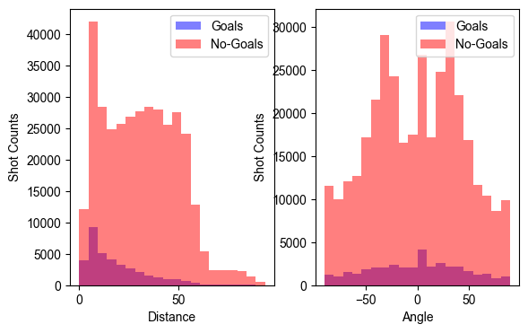 
    <p5> 
    <b>left graph :</b>
    The histograms illustrating shot counts in relation to goal outcomes, based on the dataset covering the 2016/17 to 2019/12 regular seasons, reveal a noticeable trend. As the distance from the net increases beyond 50 feet, there is a significant decrease in the number of shots on goal.
    based on the graphs there are not so many chances to shoot in a very near of the goals.
    This observed pattern may be attributed to the inherent challenges associated with longer shot distances. The probability of success for the shooter diminishes as the distance to the goal increases, potentially due to a combination of reduced accuracy and longer reaction times for goaltenders. The data suggests that shots from greater distances pose a greater challenge for both the offensive and defensive players on the ice. Also the number of goals we decreased by increase of distance. </p5>
    

    <b>right graph :</b>
    a prevalent trend emerges where shooters frequently opt for two primary angles: a direct shot straight to the net or an angle of approximately +/-30 degrees. However, the most successful goals are observed when shots are taken straight to the net. Beyond an angle of +/-30 degrees, there is a discernible decline in the frequency of scoring. This pattern underscores a preference for direct and moderately angled shots, suggesting a strategic inclination among shooters to optimize goal-scoring opportunities within specific angular ranges. </p5>
    

    

    
<b>Histograms of shot counts for distance and angle</b>

    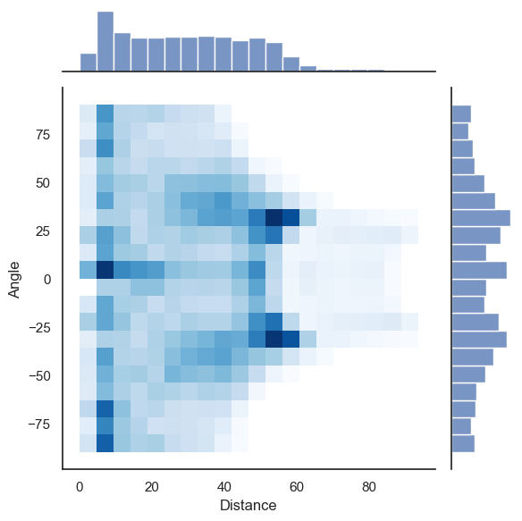 
    The 2D scatter plot and accompanying histograms depicting shot counts concerning both distance and angle offer a nuanced view of shooter behavior in the dataset.

Examining the 2D histogram, a clear trend emerges: as the distance to the goal decreases, shooters are more inclined to opt for wide-angle shots. Conversely, when positioned farther from the net, there is a propensity to take shots at a slight angle.

Remarkably, areas characterized by the highest frequency of shooting attempts are identified. These hotspots include the immediate vicinity of the goal, regions approximately 50 feet away from the net, and angles at approximately +/-30 degrees. This observation underscores specific zones on the ice where shooters are more likely to concentrate their attempts, shedding light on strategic preferences in shot selection.

<b>Histograms of goal rate</b>

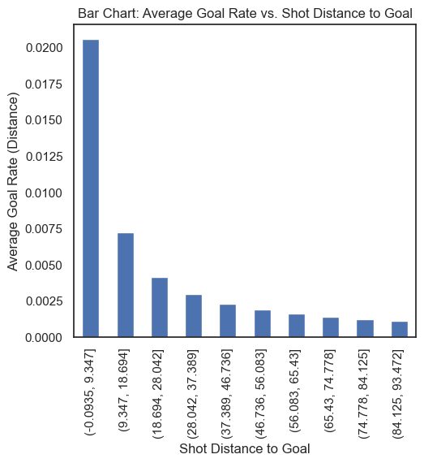 
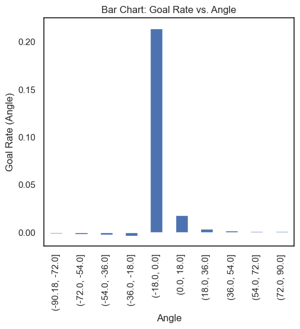 
The two Line charts depicting goal rates as a function of both distance and angle to the net provide a comprehensive overview of scoring tendencies in the dataset.

Consistent with previous observations, a clear trend emerges: as shooters approach the net, and the angle of the shot decreases, there is a notable increase in the likelihood of scoring a goal. In other words, proximity to the net and a more direct shot trajectory are positively correlated with a higher goal-scoring rate.

This finding aligns with the intuitive understanding that shooters have a greater chance of success when in close proximity to the goal, and when their shots follow a more direct path angle ([-18,+18]). The charts reinforce the notion that strategic positioning and shot selection, emphasizing shorter distances and smaller angles, play pivotal roles in enhancing the effectiveness of goal-scoring attempts. These insights contribute valuable information for understanding the nuanced dynamics of scoring in hockey based on shot distance and angle.

<b>Histograms of empty and nonempty nets</b>

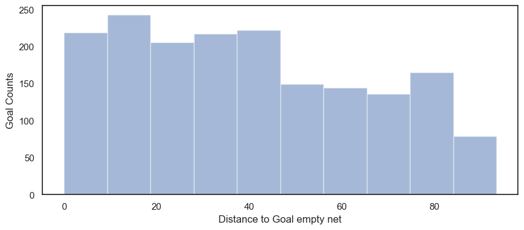 
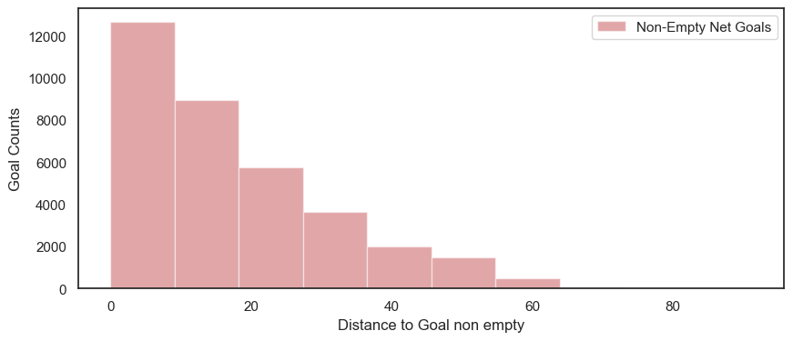 

The two histograms offer insights into the distribution of goals scored based on whether the net was empty or occupied. A conspicuous disparity lies in the distance at which goals are scored in these two scenarios. Notably, goals scored in a non-empty net tend to occur in close proximity to the goal. In stark contrast, when the net is empty, shooters demonstrate a higher likelihood of scoring from virtually any location on the court and it makes sense.
</ol>

## 2. Baseline Models

In this section, we evaluate the performance of baseline logistic regression models trained on different features of our dataset. The models were trained using only the 'distance' feature, only the 'angle' feature, and both 'distance' and 'angle' features combined.

### Baseline Model Trained on Distance

The baseline logistic regression model using only the 'distance' feature showed an accuracy of 0.9086. However, the confusion matrix:

indicates that the model predicted no positive classes, which suggests a potential issue with class imbalance or the feature's predictive capability.

### Baseline Models Trained on Angle and Both Features

Subsequent models trained on the 'angle' feature and both 'distance' and 'angle' features did not significantly improve the predictive performance, indicating that these features alone might not be sufficient for the task at hand.

### Visualization and Interpretation

The performance of these baseline models can be visually interpreted through the following plots:

The ROC curve comparison illustrates that while there is some ability to distinguish between the classes, the discriminative performance of the feature of distance is greater than that of the angle feature, and has nearly the same results obtained by using both feature

The plot depicting the goal rate against the probability percentile conveys a consistent pattern: higher probabilities predicted by the model correlate with an increased likelihood of actual goal occurrences. This reinforces the earlier inference where the 'distance' attribute outperforms the 'angle' attribute, and has a nearly identical performance as using the combination of both features.

The graph detailing the cumulative proportion of goals underscores a recurring observation: the predictive strength of the angle feature is overshadowed by that of the distance feature. Yet again, amalgamating both features delivers a nearly identical level of discrimination.

Calibration curves serve as a metric to gauge the precision of a classifier's probability estimations. A visual inspection of these curves indicates a general trend of suboptimal calibration across the models, likely attributable to data imbalance. The angle feature, when isolated, exhibits modest reliability, whereas its combination with the distance feature enhances dependability. This plot also validates the positive correlation between the distance feature and the model's scoring accuracy.

To encapsulate, the distance attribute emerges as a pivotal factor for the model's efficiency. When paired with the angle attribute, the model's efficacy is modestly amplified. In contrast, the angle attribute, on its own, exhibits a tendency to align with the random baseline rather than displaying substantial discriminative capacity.

The three models can be found under the 'models' directory within the specific Comet.ml project entry.

- **Angle Model**: The logistic regression model trained exclusively on the angle feature.
- **Distance Model**: The logistic regression model trained solely on the distance feature.
- **Combined Model**: The logistic regression model that utilizes both distance and angle features for prediction.

The models are accessible through the following Comet.ml project entry:
[Comet.ml Project: NHL Data Science](https://www.comet.com/mahmoodhegazy/nhl-data-science/916f8c382bc04495adeeef4cf15b98e9?experiment-tab=assetStorage)
### Discussion

The baseline logistic regression models provided a starting point for understanding the predictive capability of individual features. However, their performance indicates the need for more complex models or additional features to capture the nuances of the dataset effectively. Future steps would involve exploring more sophisticated models or feature engineering techniques to improve the predictive performance.

## 3. Feature Engineering II

<b> List of Added Features</b> 

<ol>
    <li> <b>gameID_eventID :</b> Event_Game ID for identifying unique events (PK)</li>
    <li> <b>game_period :</b> current period of the game.</li>
    <li> <b>game_seconds :</b> Total number of seconds elapsed in the game</li>
    <li> <b>x_coordinate :</b> shot x coordinate</li>
    <li> <b>y_coordinate :</b> shot y coordinate</li>
    <li> <b>shot_distance_to_goal :</b> distance between x,y coordinates of the shot and the net</li>
    <li> <b>shot_angle :</b> the shot angle.</li>
    <li> <b>shot_type :</b> type of shot</li>
    <li> <b>last_event :</b>  last event type</li>
    <li> <b>last_x_coordinate :</b> last event x coordinate</li>
    <li> <b>last_y_coordinate :</b> last event y coordinate</li>
    <li> <b>distance_from_last_event :</b> distance between x,y coordinates of current event and last event</li>
    <li> <b>time_from_last_event :</b> time passed in seconds since the last event</li>
    <li> <b>rebound :</b> Indicator of whether or not this is a rebound shot. Will be True on the 2nd successive shot, otherwise False.</li>
    <li> <b>speed :</b>  the distance from the previous event divided by the time since the previous event (distance_from_last_event/time_from_last_event).</li>
    <li> <b>change_in_shot_angle :</b> Represents the difference in the angles of consecutive shots relative to the goal. Specifically, it measures the deviation between the angle formed by the last shot and the goal, and the angle formed by the current rebound shot and the goal </li>
    <li> <b>time_since_powerplay_started :</b>  indicates the number of seconds that have passed since the beginning of a power-play. This timer resets to zero once the power-play concludes. </li>
    <li> <b>num_friendly_non_goalie_skaters :</b> denotes the count of skaters from the shooter's team present on the ice, excluding the goalie</li>
    <li> <b>num_opposing_non_goalie_skaters :</b> denotes the count of skaters from the opposing team present on the ice, excluding the goalie</li>
 
</ol>

<b>Comet.ml link storing the required experiment dataframe (wpg_v_wsh_2017021065):</b> 

<a href="https://www.comet.com/mahmoodhegazy/nhl-data-science/9d2048b8c5d8422db2a2e4ee3551d5c9"> https://www.comet.com/mahmoodhegazy/nhl-data-science/9d2048b8c5d8422db2a2e4ee3551d5c9 </a>

## 4. Advanced Models
At first we select these features  ['x_coordinate', 'y_coordinate', 'last_x_coordinate',
       'last_y_coordinate', 'distance_from_last_event', 'last_event',
       'rebound', 'speed', 'time_since_powerplay_started',
       'num_friendly_non_goalie_skaters', 'num_opposing_non_goalie_skaters',
       'is_emptyNet', 'shot_type', 'shot_distance_to_goal',
       'shot_angle', 'change_in_shot_angle']

For the first part we only used shot distance and shot angle and trained the model. We used 2016/17 to 2018/19 for training. This dataset then splited by train_test_split in sklearn library to training and validation set. 
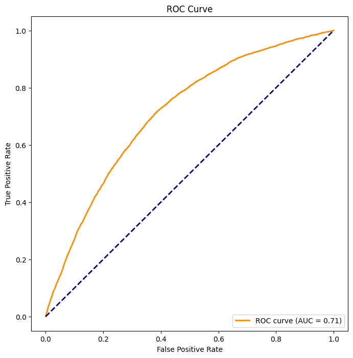 
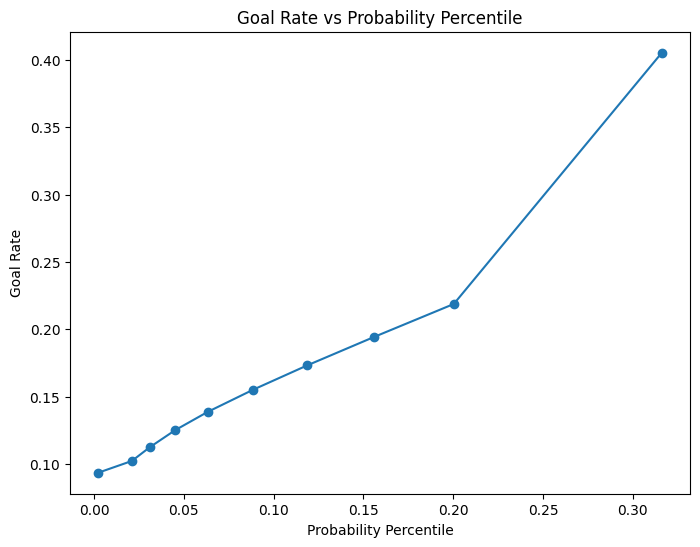 
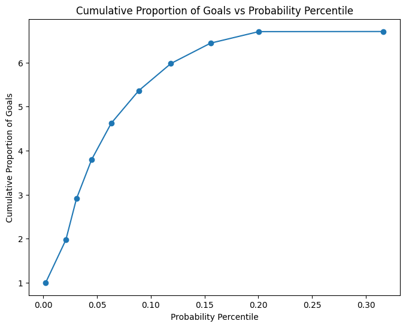 
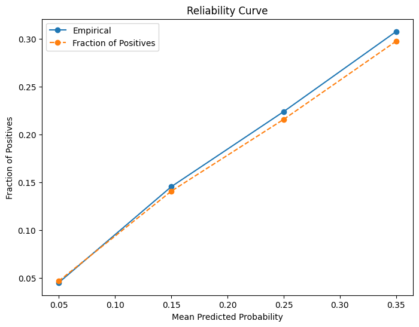 

The Receiver Operating Characteristic (ROC) curve is a graphical representation that illustrates the trade-off between true positive rate (sensitivity) and false positive rate (1-specificity) across different probability thresholds. It is commonly used to assess the performance of classification models.

Comparing goal rate against probability percentiles involves plotting the cumulative proportion of goals scored against the probability assigned by a predictive model. This curve provides insights into the model's ability to discriminate between instances that result in goals and those that do not, offering a nuanced view of its predictive accuracy.

The cumulative proportion of goals vs. probability percentile curve extends this analysis by visually displaying how the model's predicted probabilities align with the actual cumulative proportion of goals. It helps assess the model's calibration, indicating how well the predicted probabilities correspond to the observed outcomes.

A reliability curve further complements these assessments by plotting the predicted probabilities against the observed outcomes. It offers a visual depiction of the calibration of the model, providing insights into the reliability of the predicted probabilities across the entire range. A well-calibrated model will have points on the reliability curve that align closely with the diagonal, indicating accurate probability estimates.

Compare to the logistic Regression it has better Roc curve and our accuracy is higher. The most important thing is f score of xgboost is a 0.6 which is much more higher than logistic regression.

link of the baseline : https://www.comet.com/api/registry/model/item/download?modelItemId=fAzX46CrdDnjhY0KguQneBlhb

Q2. 
At first we tuned the 'n_estimators' with [100, 200, 300] and we understood 100 is the best.
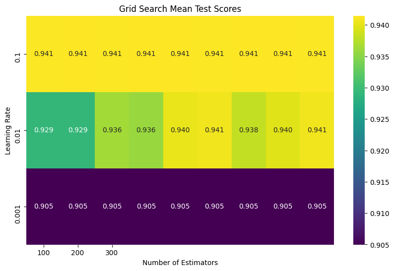 
 Then we tried to tune learning rate and max depth and figure out that the best one are 0.01 and 8 respectively 
 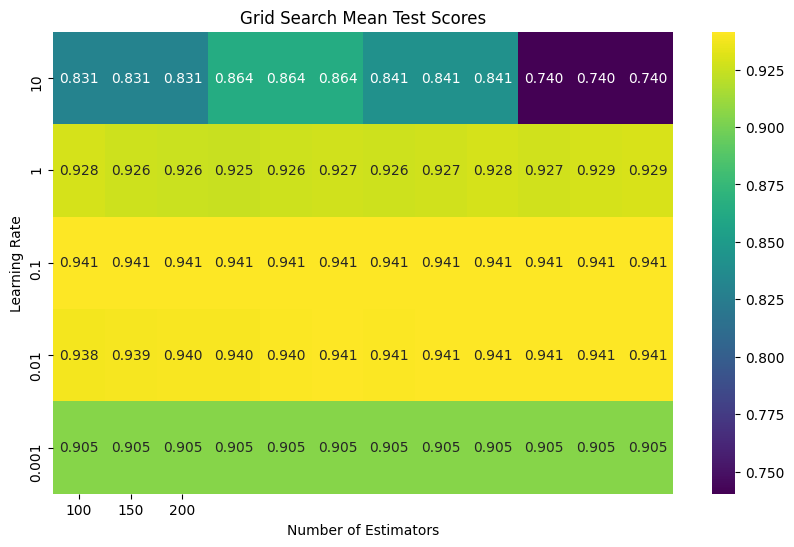 
 Then we tackle for min_child_weight, colsample_bytree, and subsample that we found 1, 0.9, 1 respectively.
 The best model performance 

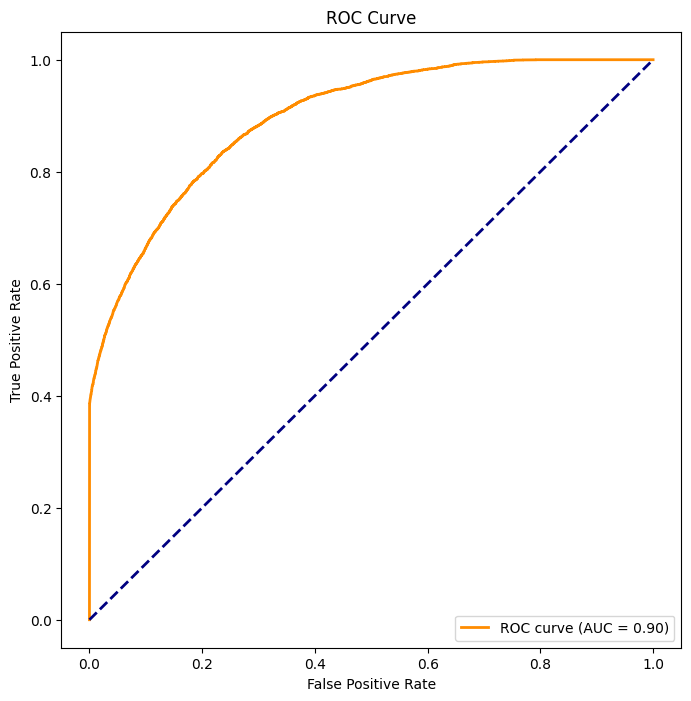 
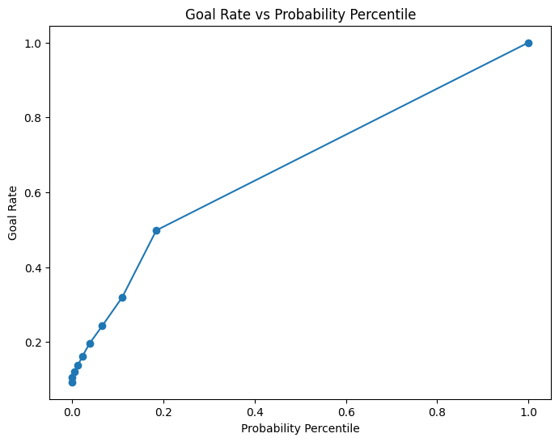 
 
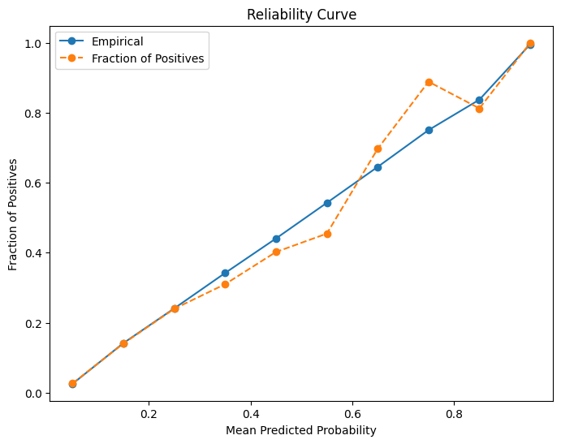 

comet link : https://www.comet.com/api/registry/model/item/download?modelItemId=hWPCs7pasfIP6DUdAxUqGwyYP

Q3. For feature selection we tried 4 different ways. corr_matirx, feature importance which is provided by XGBOOST, SHAP, Recursive feature addition. The most optimal one has been obtained by Recursive feature addition so I just share the result and the plots of the best optimal model. 

Correlation matrix
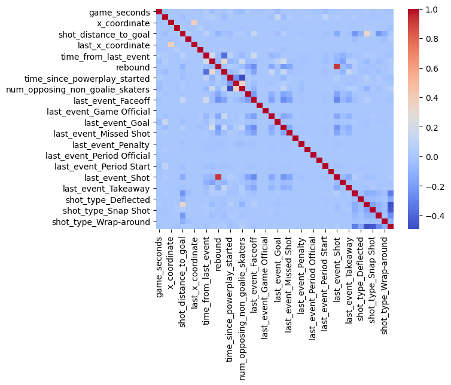 
Feature importance
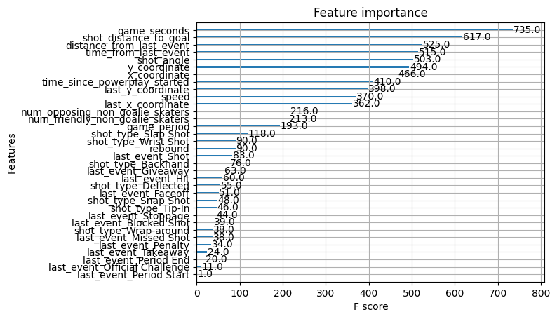 
Shap
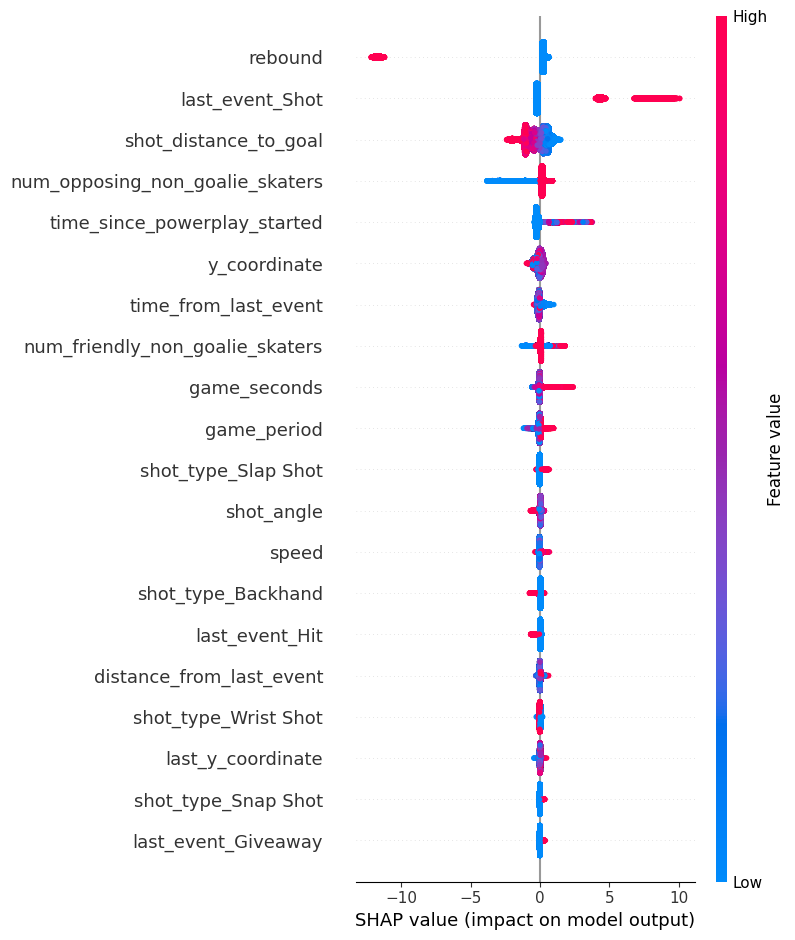 

The best one is with Recursive feature addition we found that ['game_seconds', 'game_period', 'y_coordinate', 'shot_distance_to_goal',
       'shot_angle', 'time_from_last_event', 'distance_from_last_event',
       'rebound', 'speed', 'time_since_powerplay_started',
       'num_friendly_non_goalie_skaters', 'num_opposing_non_goalie_skaters',
       'last_event_Faceoff', 'last_event_Giveaway', 'last_event_Hit',
       'last_event_Penalty', 'last_event_Period End', 'last_event_Shot',
       'last_event_Stoppage', 'shot_type_Backhand', 'shot_type_Deflected',
       'shot_type_Slap Shot', 'shot_type_Snap Shot', 'shot_type_Wrap-around',
       'shot_type_Wrist Shot']
       are the optimal features.

the best model performance plots are 
 
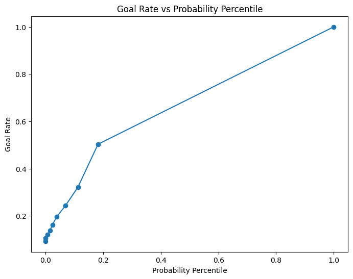 
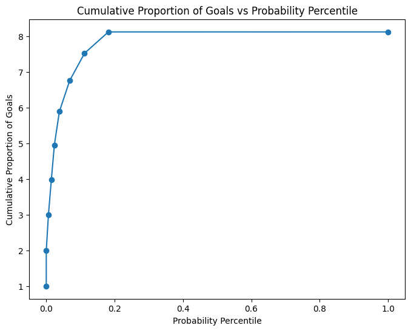 
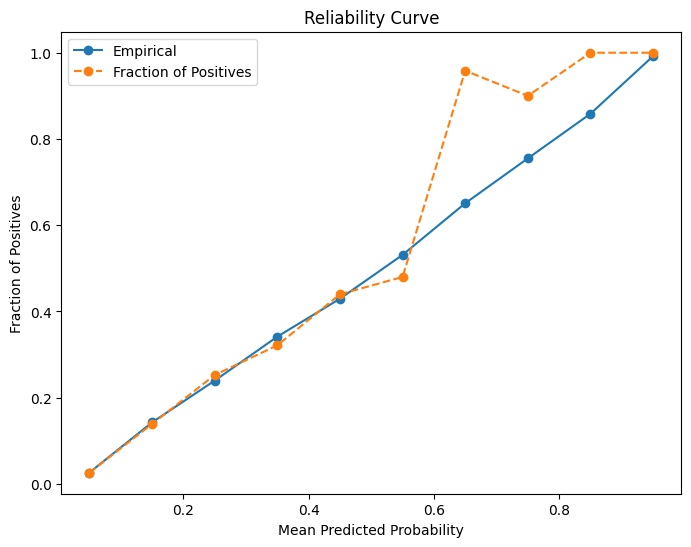 

We can see a big rise in Roc curve, the goal rate increse from 0.4 to 1 the cumulative proportion had a rise and it is more reliable model.

the features are not the same but it has a little difference in performance. 

The comet link : https://www.comet.com/api/registry/model/item/download?modelItemId=IzoEDEGOmily11cxsVglQzXdm
## 5. Other/Best Shot Models
<b> (ROC/AUC curve, goal rate vs probability percentile, cumulative proportion of goals vs probability percentile, and the reliability curve)</b>

### Experiments Setup (Same accross all experiments)

<b>Training Data</b> - All data for <b>regular</b> seasons 2016/17 - 2018/19.  

All Experiments have a pipeline created through the <b>create_pipeline</b> function found in other_ml_models.py. It is a versatile tool for building a complete machine learning pipeline, handling preprocessing (both numerical and categorical), optional feature selection, and model fitting in a streamlined and efficient manner. This setup is especially useful for ensuring consistency in data transformations across both training and testing datasets. The breakdown is as follows:

##### **Setting Up Encoders Choice**
- Initializes a dictionary `encoders` with `OrdinalEncoder` (default) and `OneHotEncoder`. 

##### **Creating Transformers**
- `numeric_transformer`: Processes numerical data by imputing missing values and scaling.
- `categorical_transformer`: Processes categorical data by imputing missing values and applying the chosen encoder.

##### **Column Transformer**
- `preprocessor`: A `ColumnTransformer` that applies the correct transformations to numerical and categorical columns.

##### **Building the Full Pipeline**
- Constructs a `Pipeline` object with the preprocessing steps, optional feature selection, and the classifier.

### Hyperparameter tunning Methodology
- Sci-kit learn's `GridSearchCV`  was used to perform Grid Search with 3-fold Cross-Validation across a pred-defined hyperparameter space (defined according to model). The method searchs through the specified subset of hyperparameters for a model and finds the most effective combination. The best model is then used for training and validation.

### Feature Selection Methodology
- Sci-kit learn's `RFECV` (Recursive Feature Elimination with Cross-Validation) was deployed on all algorithms to find the best features per model. It is a feature selection method that iteratively fits a model and removes the least important features based on certain criteria, using cross-validation to assess model performance at each step. This process continues until the optimal number of features is reached, ensuring that the selected features contribute most effectively to the model's predictive accuracy.

### Various Techniques Discussion

#### Random Forest 
Random Forest Classifiers are an ensemble learning method that operate by constructing a multitude of decision trees (weak learners) at training time, leading to improved accuracy and robustness to overfitting. They make predictions taking the majority vote across these diverse trees. It performed very well on the validation set with a **94.69%** accuracy. It was the 2'nd best performer among all classifiers. This was expected as Random Forests are very good at capturing non-linear relationships between features, which is often the case in complex scenarios like sports events where the outcome (goal or no goal) can depend on a multitude of interrelated factors.

##### **Experiment Link**

<a href="https://www.comet.com/mahmoodhegazy/nhl-data-science/34144ddb714e4845be497ce0e144f098">Random_Forest_Best_Shot</a> 

##### **Pipeline**

##### **Feature Selection and Importance** : 

##### **ROC/AUC curve**

##### **Precesion-Recall curve**

##### **Goal Rate vs probability percentile plot**

##### **Cumulative proportion of goals vs probability percentile plot**

##### **Reliability Curve**

#### CatBoost
With some intuition from Part 5 that Boosting algoriths might work well in this task, another high-performance open source library for gradient boosting on decision trees, CatBoost, was leveraged. CatBoost is particularly effective at processing categorical data. And since from our RF experiment we know that both `shot_type` and `last_event` (our only 2 categorical features) were in the top 4 important features, we thought to try CatBoost out. It performed the **best** amongst all models with a validation accuracy of **94.78%**.

##### **Experiment Link**

<a href="https://www.comet.com/mahmoodhegazy/nhl-data-science/5099680072f7468a9e7d2cec05526378">CatBoost_Best_Shot</a> 

##### **Pipeline**

##### **Feature Selection and Importance** : 

##### **ROC/AUC curve**

##### **Precesion-Recall curve**

##### **Goal Rate vs probability percentile plot**

##### **Cumulative proportion of goals vs probability percentile plot**

##### **Reliability Curve**

#### K-Nearest-Neighbours

K-Nearest Neighbors (KNN) is a supervised learning algorithm that classifies or predicts the group of a data point based on the proximity to its nearest neighbors in the dataset, operating without the need for predefined parameters. It performed well but was the weakest amongst the the afore-mentioned (part 6) models.

##### **Experiment Link**

<a href="https://www.comet.com/mahmoodhegazy/nhl-data-science/b80593d676374abb90be80dd5f748c5a">KNN_Best_Shot</a> 

##### **Pipeline**

##### **ROC/AUC curve**

##### **Precesion-Recall curve**

##### **Goal Rate vs probability percentile plot**

##### **Cumulative proportion of goals vs probability percentile plot**

##### **Reliability Curve**

#### MLP (Multi-layer Perceptron classifier)
The Multilayer Perceptron (MLP) is a type of artificial neural network that operates in a feedforward manner, effectively mapping input data to corresponding outputs. It is composed of multiple layers, with each layer being fully connected to the subsequent one. It performed well but was the weakest amongst all (part 6) models.

##### **Experiment Link**

<a href="https://www.comet.com/mahmoodhegazy/nhl-data-science/713fc623dc8d4c5eb8e54a503cb0638c">MLP_Best_Shot</a> 

##### **Pipeline**

##### **Precesion-Recall curve**

##### **ROC/AUC curve**

##### **Goal Rate vs probability percentile plot**

##### **Cumulative proportion of goals vs probability percentile plot**

##### **Reliability Curve**

### Conclusion

Picking the best model is not only looking at accuracy. We have a class imbalance where only ~10% of events are goals and therefore looking into other metrics such as precision and recall is crucial. 
 - Precision measures the accuracy of the positive predictions. In the context of our task, a high precision would mean that when our model predicts a goal, it's very likely to be a goal. This is important in scenarios where the credibility of the prediction is crucial.
 - Recall measures the ability of the model to find all relevant instances og goals. In the context of our task, a high recall would mean that the model is good at identifying shots that are likely to be goals. Favoring recall is ideal when we want to ensure you capture as many potential goal-scoring opportunities as possible, even if it means including more false positives.

 It is important to hit nice balance between precision and recall and the precision-recall curve with the highest AUC will be the best that strikes that balance. For our case that is **CatBoost**, which also happens to have the highest accuracy as well.

## 6. Evaluate on test set

## Test on 2019/20 Regular Season Dataset

Our evaluation of the five models on the untouched 2019/20 2020/21 regular season dataset yielded insightful results. While the logistic regression models showed consistent accuracy, they lacked in F1 score, recall, and precision, indicating that they may not be as effective in classifying goals within the dataset. On the other hand, the XGBoost and Cat Boost models not only showed higher accuracy but also performed significantly better across all other metrics, suggesting a more balanced classification capability.

### ROC/AUC Curves

### Goal Rate vs Probability Percentile

### Cumulative Proportion of Goals vs Probability Percentile

### Reliability Curve

The models largely mirrored their validation set performance when applied to the untouched test set, maintaining satisfactory levels of accuracy and demonstrating reliable predictive capabilities. This consistency between the validation and test sets reaffirms the robustness of the modeling approach
## Test on 2019/20 Playoff Games

### ROC/AUC Curves

### Goal Rate vs Probability Percentile

### Cumulative Proportion of Goals vs Probability Percentile

### Reliability Curve

### Summary Metrics

The table below summarizes the performance metrics of each model across both regular and playoff datasets.

| Model | Accuracy (Regular) | F1 Score (Regular) | Recall (Regular) | Precision (Regular) | Accuracy (Playoff) | F1 Score (Playoff) | Recall (Playoff) | Precision (Playoff) |
| --- | --- | --- | --- | --- | --- | --- | --- | --- |
| Logistic Regression Distance | 0.9030 | 0.0000 | 0.0000 | 0.0000 | 0.9123 | 0.0000 | 0.0000 | 0.0000 |
| Logistic Regression Angle | 0.9030 | 0.0000 | 0.0000 | 0.0000 | 0.9123 | 0.0000 | 0.0000 | 0.0000 |
| Logistic Regression Both | 0.9030 | 0.0000 | 0.0000 | 0.0000 | 0.9123 | 0.0000 | 0.0000 | 0.0000 |
| XGBoost | 0.9401 | 0.5653 | 0.4014 | 0.9557 | 0.9469 | 0.5779 | 0.4145 | 0.9539 |
| Cat Boost | 0.9440 | 0.5972 | 0.4280 | 0.9873 | 0.9512 | 0.6172 | 0.4484 | 0.9898 |

During the playoff games, our models displayed robust generalization, with the XGBoost and Cat Boost models showing improved precision and recall, suggesting their effectiveness in capturing the dynamic nature of playoff hockey. Despite high accuracy, logistic regression models continued to struggle with positive class predictions, indicating a need for more complex models for goal event prediction. The enhanced performance of complex models in playoffs, as seen in ROC/AUC and calibration curves, underscores their reliability in high-stakes scenarios, emphasizing their predictive strength over simpler models